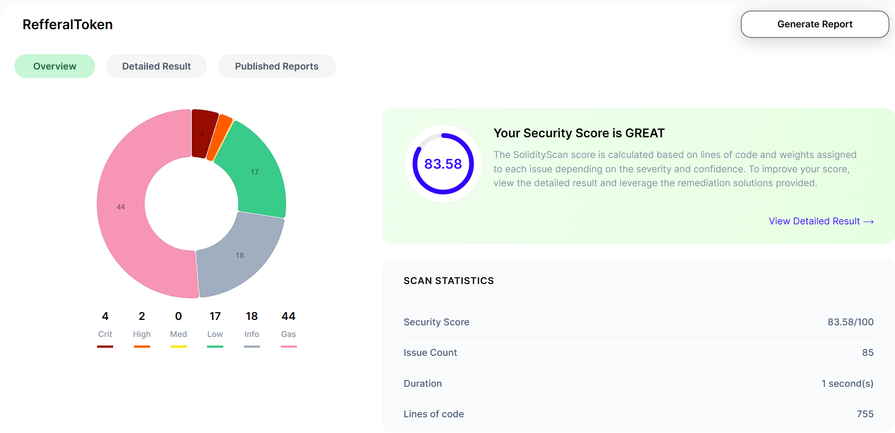
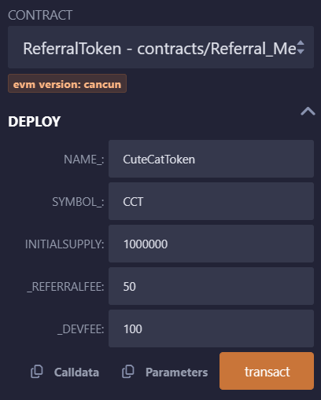
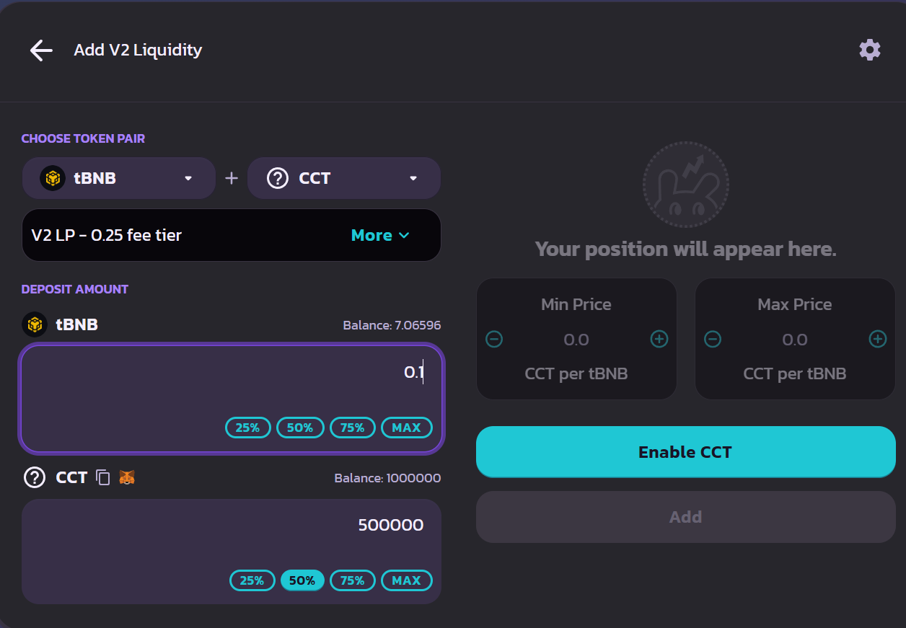
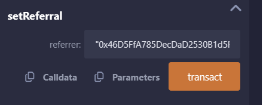
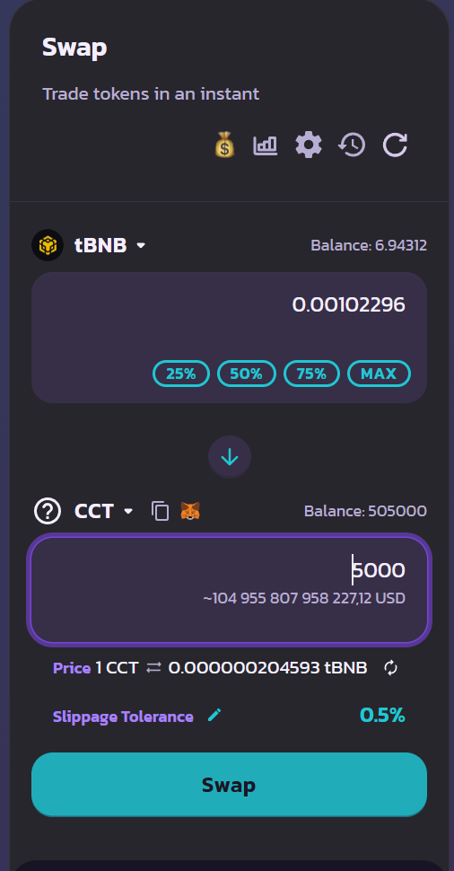
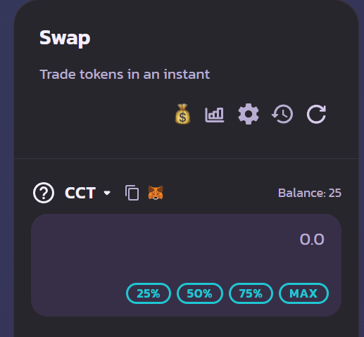

# ReferralToken Contract Documentation

[Business Idea Document](https://docs.google.com/document/d/1odehNjTt5wkz2HAJ16BPgfzLfi9vLKIqs4RkNtwRY-4/edit?usp=sharing)

[Contract Review Document](https://docs.google.com/document/d/1rOdZ3ZtDfZKYmgiatPcUlx6QkNSTE3yzMigOxl1sfME/edit?usp=sharing)

[Figma file](https://www.figma.com/file/llMxOR11X2Z2tp8tXCrjwo/ioob?type=design&node-id=93-424&mode=design)

## Overview

The ReferralToken contract is a simple ERC20 token contract with referral and developer fees. It allows users to transfer tokens and set a referrer for their account, earning referral fees for the referrer when transfers occur.

## Features

- ERC20 compliant token with name, symbol, and decimal functionalities, referralFee and devFee.
- Transfer tokens between accounts.
- Approve other accounts to spend tokens on behalf of the owner.
- Set a referrer for the account to earn referral fees.
- Developer fee is applied if no referrer is set.

## Contract Details

- **Name**: Init in constructor
- **Symbol**: Init in constructor
- **Total Supply**: Initial supply provided at deployment
- **Referral Fee**: Up to 5% (can be change later)
- **Developer Fee**: Up to 5% not less than Referral Fee (can be change later)
- **Decimals**: 18

## Add functions to ERC20

1. `setReferral(address referrer)`: Sets the referrer for the calling account.
2. `setDevFee(uint256 newFee)`: Sets the new devFee up to 5% and not less than refFee
3. `setRefFee(uint256 newFee)`: Sets the new refFee up to 5% and not greater than devFee

## Fees

- If a referrer is set, a referral fee is deducted from the transfer amount and sent to the referrer.
- If no referrer is set, a developer fee is deducted from the transfer amount and sent to the contract owner.

## Usage

1. Deploy the contract with a name, symbol, and initial supply.
2. Users can transfer tokens between accounts using the `transfer` function.
3. Users can set a referrer for their account using the `setReferral` function.
4. Referrers earn referral fees when transfers occur between their referred accounts.

## Security

- Usage of ERC20 standard
- Only referrals can set their referrer
- Usage of safe math operations to prevent overflow and underflow vulnerabilities.
- Usage of OnlyOwner for admin operations
- 83.58/100 ([solidityscan.com](https://solidityscan.com/))
  

## Tests and usage example

- Init CuteCatToken:

  

- Add liquidity:

  

- Use setReferral:

  

- Perform swap:

  

- Referrer get his share

  
